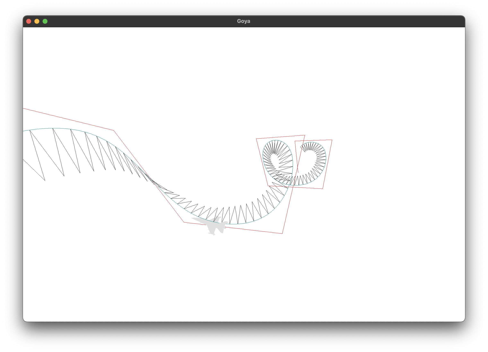
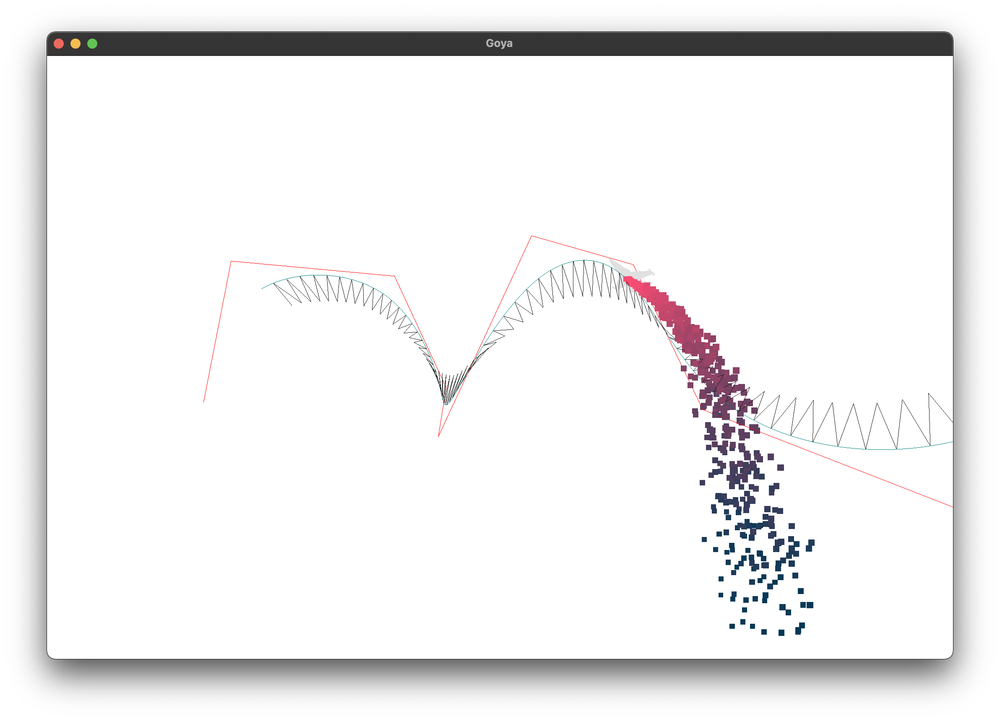
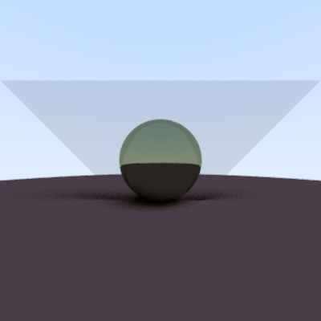

# Computer Animation Laboratory exercises

## Lab1
B-Spline based animation


## Lab2
B-Spline based animation expanded with a gravity sensitive particle system


## Lab3
Path tracing with different materials<br/><br/>


### Dependencies
  * glm
  * glfw3 
  * OpenGL
  * GLEW

  * c++17 compatible compiler

### How to build
```shell
  cmake -H./ -B./build && cmake --build build
```
